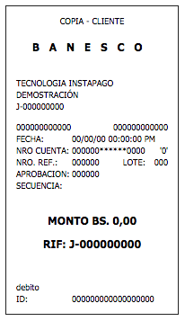

<p align="center">
    
</p>
<p align="center" style="color:#707070;">
    Documentación de la Librería Instapago para Node.js
</p>
---
## Requerimientos:

* Registro en http://instapago.com/
* Api key
    * Ir a https://banesco.instapago.com/Account/API
    * Generar la llave
    * Solicitar el envío de la llave publica por correo

> La llave pública es enviada al hacer el registro

#### Punto de Entrada del API
Todas las interacciones con Instapago se realizan a través de la siguiente dirección:

```
https://api.instapago.com
```

#### Crear Pago
Este método consta del envío de los datos de un pago con tarjeta de crédito a Instapago
para su autorización:

```
https://api.instapago.com/payment
Método: POST
```

#### FormData:

* KeyId (Requerido): Llave generada desde Instapago.
* PublicKeyId (Requerido): Llave compartida Enviada por correo al crear una cuenta
en instapago.
* Amount (Requerido): Monto a Debitar, utilizando punto “.” Como separador decimal.
Por ejemplo: 200.00.
* Description (Requerido): Cadena de caracteres con la descripción de la operación.
* CardHolder (Requerido): Nombre del Tarjeta habiente.
* CardHolderID (Requerido): Cédula o RIF del Tarjeta habiente.
* CardNumber (Requerido): Numero de la tarjeta de crédito, sin espacios ni
separadores.
* CVC (Requerido): Código secreto de la Tarjeta de crédito.
* ExpirationDate (Requerido): Fecha de expiración de la tarjeta en el formato mostrado
en la misma MM/YYYY. Por Ejemplo: 10/2014.
* StatusId (Requerido): Estatus en el que se creará la transacción.
    * "1": Retener (pre-autorización).
    * "2": Pagar (autorización).
* IP (Requerido): Dirección IP del cliente.
* OrderNumber (Opcional): Numero de orden del pago según el comercio.
* Address (Opcional): Dirección asociada a la tarjeta, Utilizada por algunos bancos
para mayor seguridad.
* City (Opcional): Ciudad asociada a la tarjeta, Utilizada por algunos bancos para
mayor seguridad.
* ZipCode (Opcional): Código Postal asociada a la tarjeta, Utilizada por algunos
bancos para mayor seguridad.
* State (Opcional): Estado o provincia asociada a la tarjeta, Utilizada por algunos
bancos para mayor seguridad.

Respuesta:

* Tipo: ```application/json```.
* Valor:

```
{
    "success": Indica si fue procesado el pago (true o false),
    "message": Descripción de la respuesta (Máx. 200 caracteres),
    "id": Código del pago (Máx. 8 caracteres),
    "code": Código del respuesta del pago (Máx. 3 caracteres),
    "reference": Código de referencia bancaria (Máx. 6 caracteres),
    "voucher": HTML que contiene el recibo del pago,
    "ordernumber": Número de orden indicado por el comercio
}
```

#### Completar pago
Este método funciona para procesar un bloqueo o pre-autorización, para así procesarla y
hacer el cobro respectivo.

```
https://api.instapago.com/complete
Método: POST
```

#### FormData:
* KeyId (Requerido): Llave generada desde Instapago.
* PublicKeyId (Requerido): Llave compartida Enviada por correo al crear una cuenta
en Instapago.
* Id (Requerido): Identificador único del pago.
* Amount (Requerido): Monto por el cual se desea procesar el pago final.

Respuesta
* Tipo: ```application/json```
* Valor:

```
{
    "success": Indica si fue procesado el pago (true o false),
    "message": Descripción de la respuesta (Máx. 200 caracteres),
    "id": Código del pago (Máx. 8 caracteres),
    "code": Código del respuesta del pago (Máx. 3 caracteres),
    "reference": Código de referencia bancaria (Máx. 6 caracteres),
    "voucher": HTML que contiene el recibo del pago,
    "ordernumber": Número de orden indicado por el comercio
}
```
### Ejemplo de voucher



#### Anular Pago
Este método funciona para procesar una anulación de un pago, ya sea un pago o un
bloqueo.

```
https://api.instapago.com/payment
Método: DELETE
```

#### FormData:
* KeyId (Requerido): Llave generada desde Instapago.
* PublicKeyId (Requerido): Llave compartida Enviada por correo al crear una cuenta
en Instapago.
* Id (Requerido): Identificador único del pago.

Respuesta
* Tipo: ```application/json```
* Valor:

```
{
    "success": Indica si fue procesado el pago (true o false),
    "message": Descripción de la respuesta (Máx. 200 caracteres),
    "id": Código del pago (Máx. 8 caracteres),
    "code": Código del respuesta del pago (Máx. 3 caracteres),
    "reference": Código de referencia bancaria (Máx. 6 caracteres),
    "ordernumber": Número de orden indicado por el comercio
}
```

#### Consulta de Pago

Este método funciona para consultar un pago generado anteriormente.

```
https://api.instapago.com/payment
Método: GET
```

Parámetros:
* KeyId (Requerido): Llave generada desde Instapago.
* PublicKeyId (Requerido): Llave compartida Enviada por correo al crear una cuenta en Instapago.
* Id (Requerido): Identificador único del pago.

Respuesta

* Tipo: ```application/json```
* Valor:

```
{
    "success": Indica si fue procesado el pago (true o false),
    "message": Descripción de la respuesta (Máx. 200 caracteres),
    "id": Código del pago (Máx. 8 caracteres),
    "code": Código del respuesta del pago (Máx. 3 caracteres),
    "reference": Código de referencia bancaria (Máx. 6 caracteres),
    "voucher": HTML que contiene el recibo del pago,
    "ordernumber": Número de orden indicado por el comercio
}
```

## Códigos de respuesta

Para todas las transacciones realizadas bajo el API, los códigos HTTP de respuestas corresponden a los siguientes estados:

* ```201```: Pago procesado con éxito.
* ```400```: Error al validar los datos enviados (Adicionalmente se devuelve una cadena de
caracteres con la descripción del error).
* ```401```: Error de autenticación, ha ocurrido un error con las llaves utilizadas.
* ```403```: Pago Rechazado por el banco.
* ```500```: Ha Ocurrido un error interno dentro del servidor.
* ```503```: Ha Ocurrido un error al procesar los parámetros de entrada. Revise los datos
enviados y vuelva a intentarlo.

> **Importante**: Si recibe un código de respuesta diferente a los antes descritos deben ser tomados como errores de protocolo HTTP.

## Tarjetas de prueba
Para realizar las pruebas, se provee de los siguientes datos para comprobar la integración:

* Tarjetas aprobadas:
Pueden indicar cualquier valor para Cédula o RIF, Fecha de Vencimiento y CVC:

    * Visa: ```4111111111111111```
    * American Express: ```378282246310005```
    * MasterCard: ```5105105105105100```
    * Sambil: ```8244001100110011``
    * Rattan: ```8244021100110011```
    * Locatel: ```8244041100110011```

* Tarjeta rechazada:

Cualquier número de tarjeta de crédito Visa, MasterCard, American Express, Sambil, Rattan y Locatel válidas serán "Rechazadas". Esto no genera ninguna transacción con el Banco.

### Ejemplos de respuesta:

Tarjeta Vencida:

```json
{
  "success":false,
  "message":"Tarjeta de Crédito Expirada",
  "id":null,
  "code":"400",
  "reference":null,
  "voucher":null,
  "ordernumber":null,
  "sequence":null,
  "approval":null,
  "lote":null
}
```

Problemas con las credenciales (api key):

```json
{
  "success": false,
  "message": "Error de autenticación. Revise sus credenciales.",
  "id": null,
  "code": "401",
  "reference": null,
  "voucher": null,
  "ordernumber": null,
  "sequence": null,
  "approval": null,
  "lote": null
}
```
> De tener este tipo de problema en especifico, debe cambiar el estado de `Key ID` a ativa en el apartado de "Configuración del API" de persistir el inconveniente debe comunicarse con el personal de instapago a los numeros  +58 (212) 963.99.22 / +58 (212) 963.01.22
